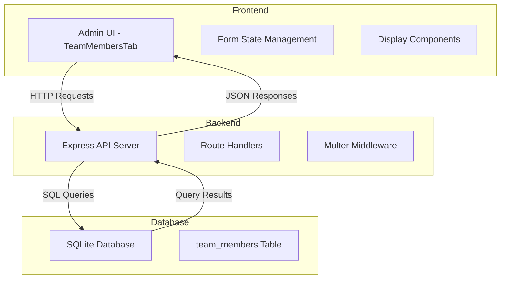

# Design Document: Team Member Descriptions

## Overview

This design document specifies the technical implementation for adding two description fields (`description1` and `description2`) to the team member management feature in the admin panel. The enhancement extends the existing team member CRUD functionality to support additional descriptive text fields.

### Current System

The existing system consists of:
- **Backend**: Node.js/Express server with SQLite database
- **Frontend**: React application with admin dashboard
- **Team Members Table**: Stores `id`, `name`, `position`, `photo_path`, `display_order`, `created_at`, `updated_at`
- **API Endpoints**: RESTful endpoints for CRUD operations on team members
- **Admin UI**: TeamMembersTab component with inline editing and add form

### Enhancement Scope

The enhancement adds two optional text fields to team members:
- `description1`: First description field (TEXT, nullable)
- `description2`: Second description field (TEXT, nullable)

These fields will be:
- Stored in the database alongside existing team member data
- Transmitted through existing API endpoints (enhanced)
- Displayed and editable in the admin UI
- Optional (not required for form submission)

## Architecture

### System Components



### Data Flow

**Create Team Member Flow:**
1. User fills form with name, position, description1, description2, and optional photo
2. Frontend sends POST request with FormData to `/api/admin/team-members`
3. Backend extracts fields from request body and file from multer
4. Backend inserts record into `team_members` table
5. Backend returns success response with created record
6. Frontend refreshes team members list

**Update Team Member Flow:**
1. User clicks "Edit" on a team member
2. Frontend populates form fields with existing values (including descriptions)
3. User modifies fields
4. Frontend sends PUT request with FormData to `/api/admin/team-members/:id`
5. Backend updates record in `team_members` table
6. Backend returns success response
7. Frontend refreshes team members list

**Read Team Members Flow:**
1. Frontend sends GET request to `/api/admin/team-members`
2. Backend queries all records from `team_members` table ordered by `display_order`
3. Backend returns JSON array of team member objects (including description fields)
4. Frontend renders team members in list view

## Components and Interfaces

### Database Schema

**Migration Required:**

```sql
ALTER TABLE team_members ADD COLUMN description1 TEXT;
ALTER TABLE team_members ADD COLUMN description2 TEXT;
```

**Updated Schema:**

```sql
CREATE TABLE team_members (
  id INTEGER PRIMARY KEY AUTOINCREMENT,
  name TEXT NOT NULL,
  position TEXT NOT NULL,
  photo_path TEXT,
  display_order INTEGER,
  description1 TEXT,
  description2 TEXT,
  created_at DATETIME DEFAULT CURRENT_TIMESTAMP,
  updated_at DATETIME DEFAULT CURRENT_TIMESTAMP
)
```

### API Endpoints

#### POST /api/admin/team-members

**Request:**
- Method: POST
- Content-Type: multipart/form-data
- Authentication: Bearer token required
- Body:
  - `name` (string, required): Team member name
  - `position` (string, required): Team member position
  - `description1` (string, optional): First description
  - `description2` (string, optional): Second description
  - `photo` (file, optional): Team member photo

**Response:**
```json
{
  "id": 5,
  "name": "John Doe",
  "position": "Senior Agent",
  "photo_path": "/uploads/1234567890-123456789.jpg",
  "display_order": 5,
  "description1": "Specializes in residential properties",
  "description2": "10 years of experience",
  "message": "Team member created successfully"
}
```

#### PUT /api/admin/team-members/:id

**Request:**
- Method: PUT
- Content-Type: multipart/form-data
- Authentication: Bearer token required
- Body:
  - `name` (string, required): Team member name
  - `position` (string, required): Team member position
  - `description1` (string, optional): First description
  - `description2` (string, optional): Second description

**Response:**
```json
{
  "message": "Team member updated successfully"
}
```

#### GET /api/admin/team-members

**Request:**
- Method: GET
- Authentication: Bearer token required

**Response:**
```json
[
  {
    "id": 1,
    "name": "John Doe",
    "position": "Senior Agent",
    "photo_path": "/uploads/1234567890-123456789.jpg",
    "display_order": 1,
    "description1": "Specializes in residential properties",
    "description2": "10 years of experience",
    "created_at": "2024-01-01 10:00:00",
    "updated_at": "2024-01-01 10:00:00"
  }
]
```

### Frontend Components

#### TeamMembersTab Component

**State Management:**

```javascript
// Add form state
const [formData, setFormData] = useState({
  name: '',
  position: '',
  description1: '',
  description2: '',
  photo: null
});

// Members list state (includes description fields)
const [members, setMembers] = useState([]);
```

**Form Structure (Add New Team Member):**

```jsx
<form onSubmit={handleAddMember} className="add-member-form">
  <h3>Add New Team Member</h3>
  
  <div className="form-group">
    <label>Name</label>
    <input type="text" value={formData.name} required />
  </div>
  
  <div className="form-group">
    <label>Position</label>
    <input type="text" value={formData.position} required />
  </div>
  
  <div className="form-group">
    <label>Description 1</label>
    <input type="text" value={formData.description1} />
  </div>
  
  <div className="form-group">
    <label>Description 2</label>
    <input type="text" value={formData.description2} />
  </div>
  
  <div className="form-group">
    <label>Photo</label>
    <input type="file" accept="image/*" />
  </div>
  
  <button type="submit">Add Member</button>
  <button type="button" onClick={handleCancel}>Cancel</button>
</form>
```

**Display Structure (View Mode):**

```jsx
<div className="member-info">
  <div className="member-name">{member.name}</div>
  <div className="member-position">{member.position}</div>
  <div className="member-description">{member.description1}</div>
  <div className="member-description">{member.description2}</div>
</div>
```

**Edit Structure (Edit Mode):**

```jsx
<div className="member-info">
  <div className="form-group">
    <label>Name</label>
    <input type="text" value={member.name} />
  </div>
  
  <div className="form-group">
    <label>Position</label>
    <input type="text" value={member.position} />
  </div>
  
  <div className="form-group">
    <label>Description 1</label>
    <input type="text" value={member.description1 || ''} />
  </div>
  
  <div className="form-group">
    <label>Description 2</label>
    <input type="text" value={member.description2 || ''} />
  </div>
</div>
```

## Data Models

### Team Member Entity

```typescript
interface TeamMember {
  id: number;
  name: string;
  position: string;
  photo_path: string | null;
  display_order: number;
  description1: string | null;
  description2: string | null;
  created_at: string;
  updated_at: string;
}
```

### Form Data Model

```typescript
interface TeamMemberFormData {
  name: string;
  position: string;
  description1: string;
  description2: string;
  photo: File | null;
}
```

### API Request/Response Models

**Create Request:**
```typescript
interface CreateTeamMemberRequest {
  name: string;
  position: string;
  description1?: string;
  description2?: string;
  photo?: File;
}
```

**Update Request:**
```typescript
interface UpdateTeamMemberRequest {
  name: string;
  position: string;
  description1?: string;
  description2?: string;
}
```

**API Response:**
```typescript
interface TeamMemberResponse {
  id: number;
  name: string;
  position: string;
  photo_path: string | null;
  display_order: number;
  description1: string | null;
  description2: string | null;
  message?: string;
}
```

## Error Handling

### Database Errors

**Schema Migration Errors:**
- **Error**: Column already exists
- **Handling**: Check if columns exist before adding (use `PRAGMA table_info(team_members)`)
- **Recovery**: Skip migration if columns already exist

**Query Errors:**
- **Error**: SQL syntax errors, constraint violations
- **Handling**: Catch errors in database callbacks, log error message
- **Response**: Return 500 status with error message to client

### API Errors

**Authentication Errors:**
- **Error**: Missing or invalid token
- **Handling**: Middleware returns 401 (missing token) or 403 (invalid token)
- **Response**: `{ error: 'Access denied' }` or `{ error: 'Invalid token' }`

**Validation Errors:**
- **Error**: Missing required fields (name, position)
- **Handling**: Check for required fields before database operation
- **Response**: Return 400 status with `{ error: 'Missing required fields' }`

**File Upload Errors:**
- **Error**: File size exceeds limit (5MB), invalid file type
- **Handling**: Multer middleware rejects request
- **Response**: Return 400 status with error message

**Database Operation Errors:**
- **Error**: Insert/update/delete failures
- **Handling**: Catch errors in database callbacks
- **Response**: Return 500 status with `{ error: err.message }`

### Frontend Errors

**Network Errors:**
- **Error**: Request timeout, connection refused
- **Handling**: Catch axios errors in try-catch blocks
- **User Feedback**: Display toast notification: "Failed to [action] team member"

**Form Validation Errors:**
- **Error**: Empty required fields (name, position)
- **Handling**: Check fields before submission
- **User Feedback**: Display toast notification: "Please enter name and position"

**State Management Errors:**
- **Error**: Editing cancelled, form reset
- **Handling**: Revert state to original values or empty strings
- **User Feedback**: No error message (expected behavior)

### Error Response Format

All API errors follow this format:
```json
{
  "error": "Error message describing what went wrong"
}
```

Success responses include a `message` field:
```json
{
  "message": "Operation completed successfully",
  "data": { /* response data */ }
}
```

## Testing Strategy

### Assessment: Property-Based Testing Applicability

This feature is **NOT suitable for property-based testing** because:

1. **Simple CRUD operations**: The feature primarily involves database reads/writes with no complex transformation logic
2. **UI-focused changes**: Most changes are in form rendering and state management
3. **External dependencies**: Testing requires database and file system interactions
4. **Limited input variation value**: Description fields accept any text; 100 iterations wouldn't reveal more bugs than 2-3 examples

**Appropriate testing approaches:**
- **Unit tests**: Test individual functions with concrete examples
- **Integration tests**: Test API endpoints with database
- **UI component tests**: Test React component rendering and interactions

### Unit Testing

**Backend Tests:**

1. **Database Migration Test**
   - Verify columns `description1` and `description2` are added to schema
   - Verify existing records have NULL values for new columns
   - Verify columns accept TEXT data type

2. **API Endpoint Tests - Create**
   - Test creating team member with description1 and description2
   - Test creating team member without descriptions (NULL values)
   - Test creating team member with only description1
   - Test creating team member with only description2
   - Test validation: missing name returns 400
   - Test validation: missing position returns 400

3. **API Endpoint Tests - Update**
   - Test updating team member with new description values
   - Test updating team member without changing descriptions
   - Test updating descriptions to empty strings
   - Test updating only description1
   - Test updating only description2

4. **API Endpoint Tests - Read**
   - Test GET returns description1 and description2 fields
   - Test GET returns NULL for records without descriptions
   - Test GET returns all team members with descriptions

**Frontend Tests:**

1. **Form State Management Tests**
   - Test initial state has empty description1 and description2
   - Test form state updates when description fields change
   - Test form reset clears description fields
   - Test cancel reverts description fields to original values

2. **Form Submission Tests**
   - Test form submits description1 and description2 to API
   - Test form submits empty strings when descriptions not entered
   - Test form includes descriptions in FormData

3. **Display Tests**
   - Test description fields render in view mode
   - Test empty descriptions render as empty space
   - Test description fields render in edit mode
   - Test description fields populate with existing values in edit mode

### Integration Testing

1. **End-to-End Create Flow**
   - Create team member with descriptions through UI
   - Verify record saved in database with correct values
   - Verify team member displays in list with descriptions

2. **End-to-End Update Flow**
   - Edit existing team member and add descriptions
   - Verify database updated with new values
   - Verify updated descriptions display in list

3. **End-to-End Read Flow**
   - Fetch team members from API
   - Verify response includes description fields
   - Verify UI renders descriptions correctly

4. **Backward Compatibility Test**
   - Create team member without descriptions (legacy behavior)
   - Verify record created successfully
   - Verify NULL descriptions handled correctly in UI

### Manual Testing Checklist

- [ ] Add new team member with both descriptions
- [ ] Add new team member with only description1
- [ ] Add new team member with only description2
- [ ] Add new team member without any descriptions
- [ ] Edit existing team member and add descriptions
- [ ] Edit existing team member and modify descriptions
- [ ] Edit existing team member and clear descriptions
- [ ] Verify descriptions display correctly in list view
- [ ] Verify empty descriptions don't break layout
- [ ] Verify form cancel resets description fields
- [ ] Verify form validation still works for required fields
- [ ] Verify existing team members (created before migration) display correctly
- [ ] Verify reordering team members preserves descriptions
- [ ] Verify deleting team member works with descriptions

### Test Data Examples

**Example 1: Team member with both descriptions**
```json
{
  "name": "John Doe",
  "position": "Senior Real Estate Agent",
  "description1": "Specializes in residential properties in downtown area",
  "description2": "15 years of experience, fluent in English and Spanish"
}
```

**Example 2: Team member with one description**
```json
{
  "name": "Jane Smith",
  "position": "Property Manager",
  "description1": "Manages commercial properties",
  "description2": ""
}
```

**Example 3: Team member without descriptions (backward compatibility)**
```json
{
  "name": "Bob Johnson",
  "position": "Sales Associate",
  "description1": null,
  "description2": null
}
```

### Edge Cases to Test

1. **Very long description text**: Test with 1000+ character strings
2. **Special characters**: Test with Unicode, emojis, HTML entities
3. **Whitespace**: Test with leading/trailing spaces, multiple spaces
4. **Empty strings vs NULL**: Verify both are handled correctly
5. **Concurrent edits**: Test editing multiple team members simultaneously
6. **Network failures**: Test behavior when API requests fail
7. **Database constraints**: Test behavior if database is locked or unavailable

## Implementation Notes

### Database Migration

The database migration should be implemented in `backend/database.js` in the `initializeDatabase()` function. Use a safe migration approach:

```javascript
// Check if columns exist before adding
db.all("PRAGMA table_info(team_members)", (err, columns) => {
  const hasDescription1 = columns.some(col => col.name === 'description1');
  const hasDescription2 = columns.some(col => col.name === 'description2');
  
  if (!hasDescription1) {
    db.run("ALTER TABLE team_members ADD COLUMN description1 TEXT");
  }
  
  if (!hasDescription2) {
    db.run("ALTER TABLE team_members ADD COLUMN description2 TEXT");
  }
});
```

### Backend Implementation

**Modify POST /api/admin/team-members:**
```javascript
app.post('/api/admin/team-members', authenticateToken, upload.single('photo'), (req, res) => {
  const { name, position, description1, description2 } = req.body;
  const photo_path = req.file ? `/uploads/${req.file.filename}` : null;

  db.get('SELECT MAX(display_order) as max_order FROM team_members', (err, row) => {
    const display_order = (row && row.max_order) ? row.max_order + 1 : 1;

    db.run(
      'INSERT INTO team_members (name, position, photo_path, display_order, description1, description2) VALUES (?, ?, ?, ?, ?, ?)',
      [name, position, photo_path, display_order, description1 || null, description2 || null],
      function(err) {
        if (err) {
          return res.status(500).json({ error: err.message });
        }
        res.json({ 
          id: this.lastID, 
          name, 
          position,
          photo_path,
          display_order,
          description1: description1 || null,
          description2: description2 || null,
          message: 'Team member created successfully' 
        });
      }
    );
  });
});
```

**Modify PUT /api/admin/team-members/:id:**
```javascript
app.put('/api/admin/team-members/:id', authenticateToken, upload.single('photo'), (req, res) => {
  const { id } = req.params;
  const { name, position, description1, description2 } = req.body;

  db.run(
    'UPDATE team_members SET name = ?, position = ?, description1 = ?, description2 = ?, updated_at = CURRENT_TIMESTAMP WHERE id = ?',
    [name, position, description1 || null, description2 || null, id],
    function(err) {
      if (err) {
        return res.status(500).json({ error: err.message });
      }
      res.json({ message: 'Team member updated successfully' });
    }
  );
});
```

### Frontend Implementation

**Update formData state:**
```javascript
const [formData, setFormData] = useState({
  name: '',
  position: '',
  description1: '',
  description2: '',
  photo: null
});
```

**Add description fields to add form:**
```jsx
<div className="form-group">
  <label>Description 1</label>
  <input
    type="text"
    value={formData.description1}
    onChange={(e) => setFormData({ ...formData, description1: e.target.value })}
    placeholder="Enter first description (optional)"
  />
</div>
<div className="form-group">
  <label>Description 2</label>
  <input
    type="text"
    value={formData.description2}
    onChange={(e) => setFormData({ ...formData, description2: e.target.value })}
    placeholder="Enter second description (optional)"
  />
</div>
```

**Update handleAddMember to include descriptions:**
```javascript
const data = new FormData();
data.append('name', formData.name);
data.append('position', formData.position);
data.append('description1', formData.description1);
data.append('description2', formData.description2);
if (formData.photo) {
  data.append('photo', formData.photo);
}
```

**Update handleUpdateMember to include descriptions:**
```javascript
const data = new FormData();
data.append('name', member.name);
data.append('position', member.position);
data.append('description1', member.description1 || '');
data.append('description2', member.description2 || '');
```

**Add description fields to edit mode:**
```jsx
<div className="form-group">
  <label>Description 1</label>
  <input
    type="text"
    value={member.description1 || ''}
    onChange={(e) => handleMemberChange(member.id, 'description1', e.target.value)}
    placeholder="Description 1"
  />
</div>
<div className="form-group">
  <label>Description 2</label>
  <input
    type="text"
    value={member.description2 || ''}
    onChange={(e) => handleMemberChange(member.id, 'description2', e.target.value)}
    placeholder="Description 2"
  />
</div>
```

**Add description fields to view mode:**
```jsx
{member.description1 && (
  <div className="member-description">{member.description1}</div>
)}
{member.description2 && (
  <div className="member-description">{member.description2}</div>
)}
```

**Update form reset to include descriptions:**
```javascript
setFormData({ name: '', position: '', description1: '', description2: '', photo: null });
```

### Styling Considerations

Add CSS for description display:
```css
.member-description {
  color: #666;
  font-size: 13px;
  margin-top: 4px;
  line-height: 1.4;
}
```

Ensure form groups have consistent spacing and the description fields integrate seamlessly with existing form styling.
